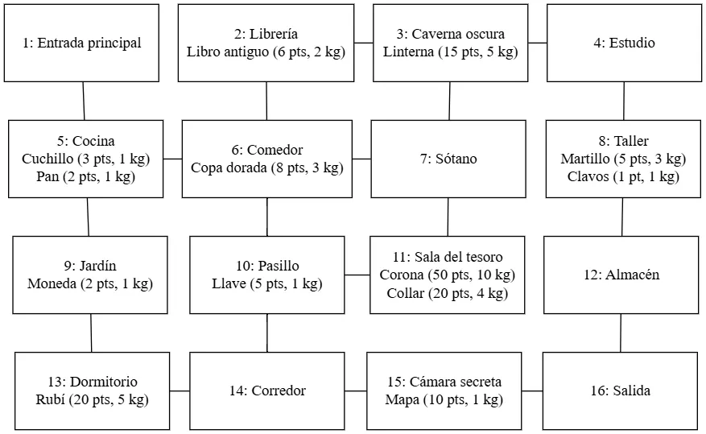

# GraphQuest

GraphQuest es un juego de aventuras basado en texto donde el jugador explora un laberinto representado como un grafo. Cada nodo del grafo es un escenario con posibles conexiones en 4 direcciones (arriba, abajo, izquierda, derecha), y puede contener objetos con distintos valores y pesos. El objetivo es explorar, recolectar objetos y alcanzar el escenario final antes de que se agote el tiempo.

## 🗺️ Mapa del juego

El mapa del juego está estructurado como un grafo de 16 escenarios conectados. Aquí puedes ver la distribución completa:

 `ctrl + clic`

## 🚀 Compilación

Este proyecto está escrito en C y requiere el compilador `gcc`. Para compilar el proyecto, asegúrate de tener los siguientes archivos:

- `main.c`
- `extra.h` y `extra.c`
- `list.h` y `list.c`
- `map.h` y `map.c`

### Comando de compilación

```bash
gcc tarea3.c list.c map.c extra.c -o tarea3 -lm
```

### Para ejecutar el juego

```bash
./tarea3.exe
```

## 📄 Formato del archivo `graphquest.csv`

Cada línea del archivo representa un escenario con el siguiente formato:

```
ID,Nombre,Descripción,Items,Arriba,Abajo,Izquierda,Derecha,EsFinal
```

- **Items**: `nombre,valor,peso;nombre2,valor2,peso2`
- **Conexiones**: IDs de escenarios adyacentes o `-1` si no hay conexión
- **EsFinal**: "Si" si es la sala de salida, "No" en otro caso

### Ejemplo:

```
1,Entrada principal,Inicio del juego,-,-1,2,-1,-1,No
2,Librería,Libros antiguos,Libro antiguo,6,2,1,3,No
...
16,Salida,¡Has escapado!,-,-1,-1,15,-1,Si
```

## 🎮 Instrucciones del Juego

- **Recoger item**: Añade un objeto del escenario al inventario
- **Descartar item**: Elimina un objeto del inventario
- **Moverse**: Navega a escenarios adyacentes
- **Reiniciar juego**: Vuelve al escenario inicial
- **Salir**: Termina la partida

El tiempo restante disminuye según el peso del inventario.

## 🧠 Estructuras de Datos

- `Map`: Grafo de escenarios
- `List`: Inventario e items
- `Structs`: para modelar `Item`, `Escenario`, `Grafo`, `EstadoJuego`

## 🧼 Gestión de Memoria

Se libera toda la memoria dinámica utilizada para escenarios, items e inventario al finalizar el juego.

### Limitaciones conocidas

El programa presenta un error al leer algunas de las descripciones de lashabitaciones cuando las palabras llevan puntos suspensivos (...). Por ejemplo al leer "Restos de una batalla culinaria. Cuchillos por aqui, migajas por alla. Alguien cocino… o fue cocinado." ocurre esto "Restos de una batalla culinaria. Cuchillos por aqui, migajas por alla. Alguien `cocinoÔǪ` o fue cocinado." puede interpretarse incorrectamente debido al formato de entrada.

---

## 📋 Créditos

Desarrollado como proyecto educativo para practicar estructuras de datos en C.
